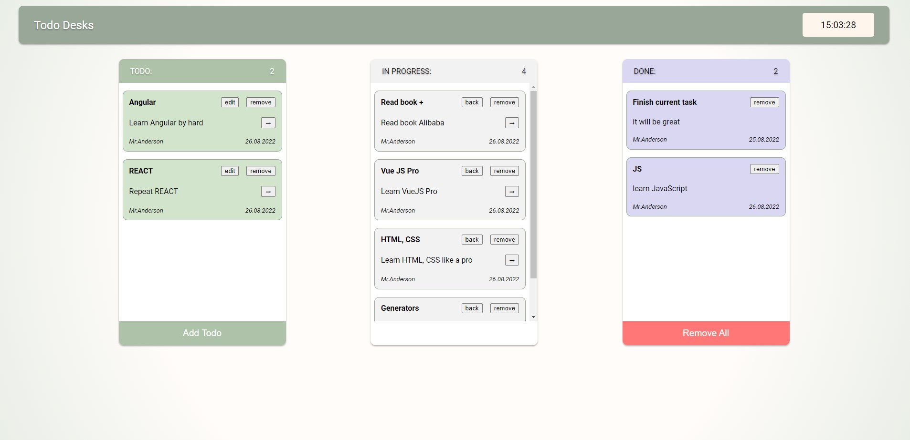

# Trello desks todo application
[RUN APPLICATION](https://dmitrykolotilshikov.github.io/trello-desks-todo-app/)

```
    Trello todos application (Pure HTML, CSS, JavaScript)
    Backend on mockapi.io
```
```
  Functionality:
   • OOP principles
   • Application written with classes
   • Active clock in header
   • 3 desks: create, progress, done
   • Mobile friendly
   • Todo functionality: add, move, remove, edit
   • Remove All
   • Displaying count of todos in desks
   • Modal windows: warning, confirm, menu
   • Error handling
   • Loader (spinner) loading.io/css
```




---
© [Dmitry Kolotilshikov](https://github.com/DmitryKolotilshikov)
